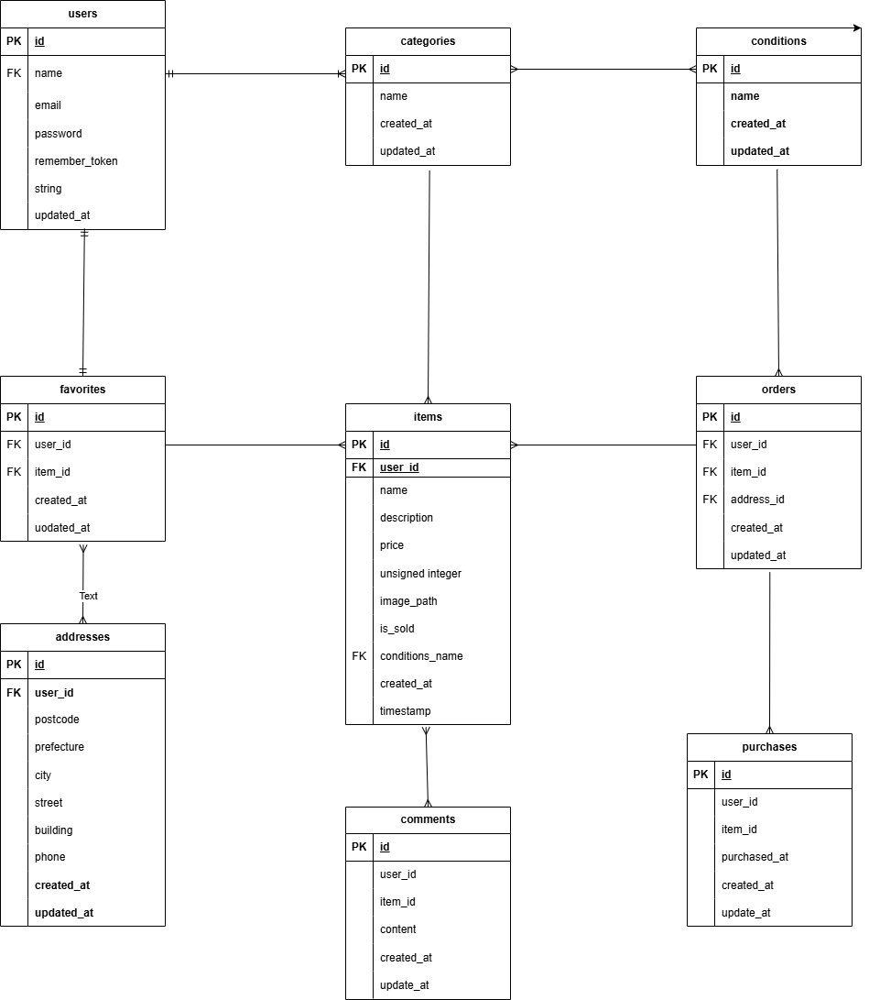

# アプリケーション名称
coachtech フリマアプリ

# 環境構築

## Dockerビルド
- 'git clone git@github.com:KAE312/mogi1.git'
- 'docker compose up -d --build'

## Laravel環境構築
- 'docker-compose exec php bash'
- 'composer install'
- 'cp .env.example .env'　sy
- 'php artisan key:minion312'
- 'php artisan migrate'
- 'php artisan db:seed'

---

## 開発環境
- 会員登録画面: [http://locahost/register](http://localhost/register)
- プロフィール設定画面_初回ログイン時: [http://locahost/edit](http://localhost/edit)
- ログイン画面: [http://locahost/login](http://localhost/login)

## 使用技術（実行環境）
- Laravel 8.x  
- PHP 7.3以上 または 8.0以上  
- Laravel Fortify 1.19  
- MySQL（`.env` で接続設定）  
- laravel-lang/lang 12.17  

## ER図

## URL 
http://localhost/

